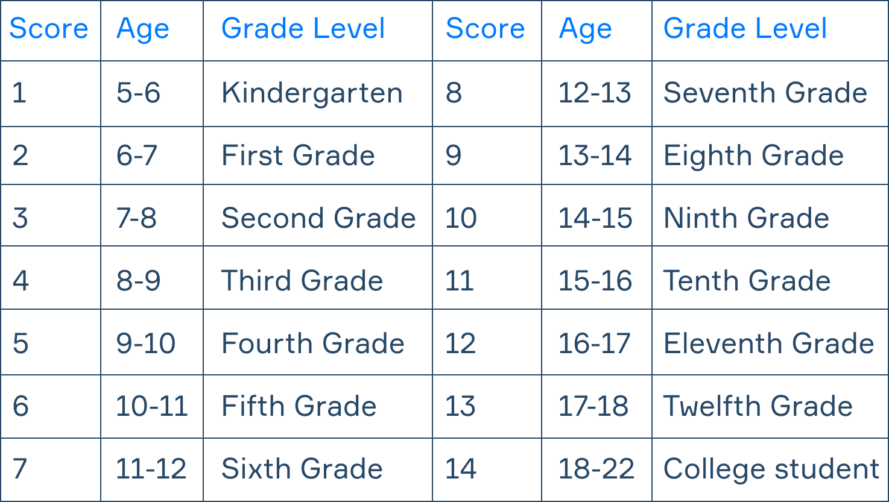

# Readability Index

This console application reads a file, the filename is expected through the command line arguments.

The program outputs the score itself and an approximate age needed to comprehend the text.

The program also prints how many characters, words, sentences, syllables and polysyllables the text has.

1. [Automated readability index](https://en.wikipedia.org/wiki/Automated_readability_index) (ARI)
2. [Flesch–Kincaid readability tests](https://en.wikipedia.org/wiki/Flesch%E2%80%93Kincaid_readability_tests) (FK)
3. [Simple Measure of Gobbledygook grade](https://en.wikipedia.org/wiki/SMOG) (SMOG)
4. [Coleman–Liau index](https://en.wikipedia.org/wiki/Coleman%E2%80%93Liau_index) (CL)



A character is any visible symbol.

Polysyllables are words with more than 2 syllables.

To calculate the age, the upper bound of the range is used.

Letters a, e, i, o, u, y are used as [vowels](https://simple.wikipedia.org/wiki/Vowel). The following 4 rules are used to count the number of syllables:

1. Count the number of vowels in the word.
2. Do not count diphthongs twice (for example, "rain" has 2 vowels but only 1 syllable).
3. If the last letter in the word is 'e' do not count it as a vowel (for example, "side" has 1 syllable).
4. If at the end it turns out that the word contains 0 vowels, then consider this word as a 1-syllable one.

### Example
```
> java Main example.txt
The text is:
This is the front page of the Simple English Wikipedia. Wikipedias are places where people work together to write encyclopedias in different languages. We use Simple English words and grammar here. The Simple English Wikipedia is for everyone! That includes children and adults who are learning English. There are 142,262 articles on the Simple English Wikipedia. All of the pages are free to use. They have all been published under both the Creative Commons License and the GNU Free Documentation License. You can help here! You may change these pages and make new pages. Read the help pages and other good pages to learn how to write pages here. If you need help, you may ask questions at Simple talk. Use Basic English vocabulary and shorter sentences. This allows people to understand normally complex terms or phrases.

Words: 137
Sentences: 14
Characters: 687
Syllables: 210
Polysyllables: 17
Enter the score you want to calculate (ARI, FK, SMOG, CL, all): all

Automated Readability Index: 7.08 (about 13-year-olds).
Flesch–Kincaid readability tests: 6.31 (about 12-year-olds).
Simple Measure of Gobbledygook: 9.42 (about 15-year-olds).
Coleman–Liau index: 10.66 (about 17-year-olds).

This text should be understood in average by 14.25-year-olds.
```